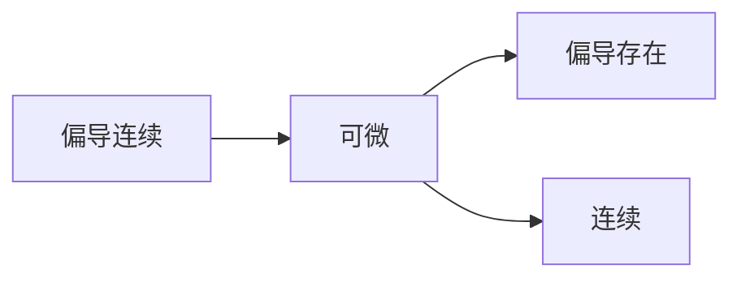

>⚠️ Unsorted

> 🔍全部cp自[峰考的高数速通](https://www.bilibili.com/video/BV16CNTesEFN)，可自行观看
# 人类的复习是有极限的
## 等价无穷小
when $x \to 0$,
1. $x$ ~ $sin\ x$ ~ $tan\ x$ ~ $arcsin\ x$ ~ $arctan\ x$ ~$ln(1+x)$ ~ $e^x-1$
2. $1-cos\ x$ ~ $\frac{1}{2}x^2$  ;  $1-cos^a\ x$ ~ $\frac{a}{2}x^2$
3. $(1+x)^a-1$ ~ $ax$  ;  $\sqrt{1+x}-1$ ~ $\frac{1}{2}x$

## 重要极限
- $\underset{x \to 0}{\lim}\frac{sin\ x}{x}=1$
- $\underset{x \to 0}{\lim}(1+x)^{\frac{1}{x}}=e$
# 考试导一导，分数没烦恼
## 求导公式
+ $(x^\mu)'=\mu x^{\mu -1}$
+ $(e^x)'=e^x$
+ $(ln\ x)'=\frac{1}{x}$
+ $(a^x)'=a^x\ ln\ a$
+ $(sin\ x)'=cos\ x$
+ $(cos\ x)'=-sin\ x$
未知领域：
- $(log_a\ x)'=\frac{1}{x\ ln\ a}$
- $(tan\ x)'=sec^2\ x=\frac{1}{cos^2\ x}$
- $(cot\ x)'=-csc^2\ x=-\frac{1}{sin^2\ x}$
- $(sec\ x)'=sec\ x\ tan\ x$
- $(csc\ x)'=-csc\ x\ cot\ x$
- $(arctan\ x)'=\frac{1}{1+x^2}$
- $(arcsin\ x)'=\frac{1}{\sqrt{1-x^2}}$
- $(arccot\ x)'=-\frac{1}{1+x^2}$
- $(arccos\ x)'=-\frac{1}{\sqrt{1-x^2}}$

## 偏导、连续、可微之间的关系

## 隐函数求偏导
1. 构造函数$F(x,y,z)$
2. 求$F_X$ 、$F_y$ 、$F_z$
3. $\frac{\partial z}{\partial x}=-\frac{F_x}{F_z}$  ;  $\frac{\partial z}{\partial y}=-\frac{F_y}{F_z}$
# 多元函数取极值
1. 求驻点（$f_x'(x,y)=0\ \land\ f_y'(x,y)=0$）
2. 求 $A=f_{xx}''$  ;  $B=f_{xy}''$  ;  $C=f_{yy}''$
3. **对所求驻点判定**：
   $$AC-B^2\begin{cases}>0 & 有极值，且A \begin{cases}>0 & 极小值 \\ <0 & 极大值\end{cases}\\<0 & 无极值 \\=0 & 不确定\end{cases}$$
# 条件极值
1. 目标函数（题目的条件）$f(x,y,z)$
2. 条件函数（题目中量的限定条件）$g(x,y,z)$
3. **构造拉格朗日函数** 
   $$\begin{align}L=f(x,y,z)+\lambda g(x,y,z) \\\begin{cases}L_x=0 \\ L_y=0 \\ L_z=0 \\ L_z=0\end{cases} \implies (x_0,y_0,z_0)\end{align}$$
   是为所求极值点。

# 叉乘
$$\begin{gathered}A=a_1\hat{i}+b_1\hat{j}+c_1\hat{k} \ ;\ B=a_2\hat{i}+b_2\hat{j}+c_2\hat{k}\\A \times B = \begin{vmatrix}\hat{i} & \hat{j} & \hat{k} \\ a_1 & b_1 &c_1 \\ a_2 &b_2 &c_2\end{vmatrix}=|A ||B|sin\ \theta\end{gathered}$$
另：
$$\begin{gathered}A=a_1\hat{i}+b_1\hat{j}+c_1\hat{k} \ ;\ B=a_2\hat{i}+b_2\hat{j}+c_2\hat{k}\ ;\ C=a_3\hat{i}+b_3\hat{j}+c_3\hat{k}\\ (A \times B)\cdot C=\begin{vmatrix}a_1&b_1&c_1\\a_2&b_2&c_2\\a_3&b_3&c_3\end{vmatrix}\end{gathered}$$

# 3 Dimensions !!!!!
## 空间平面
对于平面上点$P(x_0,y_0,z_0)$，法向量$\vec{n}=(A,B,C)$
点法式：$A(x-x_0)+B(y-y_0)+C(z-z_0)=0$
## 点到平面距离
$$d=\frac{|Ax_0+By_0+Cz_0+D|}{\sqrt{A^2+B^2+C^2}}$$
## 空间直线
线上点$P(x_0,y_0,z_0)$，平面方向向量$\vec{s}=(A,B,C)$
**对称式：** $\frac{x-x_0}{A}=\frac{y-y_0}{B}=\frac{z-z_0}{C}$
一般式： $\begin{cases}A_1x+B_1y+C_1z+D_1=0 \\ A_2x+B_2y+C_2z+D_2=0\end{cases}$
参数方程：$\begin{cases}x=At+x_0 \\ y=Bt+y_0 \\ z=Ct+z_0\end{cases}$
## 空间曲线旋转
for axis $x$, $y$, $z$, let $a,b,c \in \{x,y,z\}$ 
when it is in plain $aob$, $f(a,b)$ rotates around the $a$-axis, $a$ stays constant, $b \leftrightarrow \sqrt{b^2+c^2}$
## 空间曲面：法线、切平面
![[QQ_1783068050154.png]]

曲面 $S(x,y,z)$，法线的向量$\vec{n}=\nabla S$

## 空间曲线：切线、法平面
![[QQ_1783068602490.png]]

曲线$\begin{cases}x=x(t)\\ y=y(t)\\ z=z(t)\end{cases}$，切线的向量$\vec{s}=(\frac{dx}{dt},\frac{dy}{dt},\frac{dz}{dt})$

# ！？积积？！
## 基础版本
$$\underset{D}{\iint}f(x,y)d\sigma=\underset{D}{\iint}f(x,y)dxdy={\int_{x_{begin}}^{x_{end}}dx\int_{y=f(x_{begin})}^{y=f(x_{end})}f(x,y)dy}$$
## 直角坐标系 -> 极坐标系
$$\underset{D}{\iint}f(x,y)d\sigma=\underset{D'}{\iint}f(\rho \ cos\ \theta,\rho\ sin\ \theta)\cdot \rho\ d\rho d\theta$$
## 空间直角系 -> 球系
$$\underset{\Omega}{\iiint}f(x,y,z)dV=\int_{\theta_1}^{\theta_2}d\theta \int_{\phi_1}^{\phi_2}d\phi \int_{\rho_1(\phi,\theta)}^{\rho_2(\phi,\theta)}f(\rho\ sin\phi\ cos\theta,\rho\ sin\phi\ sin\theta,\rho\ cos\phi)\rho^2sin\phi d\rho$$
## 曲线积分 I
for curve $\begin{cases}x=x(t)\\y=y(t)\end{cases}$ :
$$\underset{L}{\int}f(x,y)ds=\int f[x(t),y(t)]\sqrt{(\frac{dx}{dt})^2+(\frac{dy}{dt})^2}\ dt$$
## 曲线积分 II
for curve $\begin{cases}x=x(t)\\y=y(t)\end{cases}$ :
$$\underset{L}{\int}P(x,y)dx+Q(x,y)dy=\int \{P[x(t),y(t)]\cdot\frac{dx}{dt}+Q[x(t),y(t)]\cdot\frac{dy}{dt}\}\ dt$$
## 格林公式
$$\underset{L}{\oint}Pdx+Qdy=\pm\underset{D}{\iint}(\frac{\partial Q}{\partial x}-\frac{\partial P}{\partial y})dxdy$$
以逆时针为正方向。
## 曲面积分 I
$$\underset{\Sigma}{\iint}f(x,y,z)dS=\underset{D_{xy}}{\iint}f[x,y,z(x,y)]\sqrt{1+(\frac{\partial z}{\partial x})^2+(\frac{\partial z}{\partial y})^2}\ dxdy$$
## 曲面积分 II
$$R(x,y,z)dxdy=\pm\underset{D_{xy}}{\iint}R(x,y,z(x,y))dxdy$$
法向量向上时取正。
## 高斯公式
$$\underset{\Sigma}{\oint\oint}Pdydz+Qdxdz+Rdxdy=\pm\underset{\Omega}{\iiint}(\frac{\partial P}{\partial x}+\frac{\partial Q}{\partial y}+\frac{\partial R}{\partial z})dxdydz$$
曲面外侧取正。
# ↑→↓↓→（级数）
其实就是数列。$$\underset{n=1}{\overset{\infty}{\sum}}u_n=u_1+u_2+...+u_n+...$$
## 收敛：定义
$S(n)=\underset{n=1}{\overset{\infty}{\sum}}u_n$  ;  $\underset{n \to \infty}{\lim}S(n)=A$  则级数收敛，反之发散。
## 重要的参照级数
1. 几何级数：$$\underset{n=1}{\overset{\infty}{\sum}}aq^n\begin{cases}|q|<1&级数收敛\\|q|\ge1&级数发散\end{cases}$$
2. 调和级数：$$\underset{n=1}{\overset{\infty}{\sum}}\frac{1}{n^p}\ \begin{cases}p>1&级数收敛\\p\le1&级数发散\end{cases}$$
## 审敛法達
### 比值审敛法
$$\underset{n \to \infty}{\lim}\frac{u_{n+1}}{u_n}=\rho\begin{cases}\rho <1&收敛\\\rho>1&发散\\\rho=1&不确定\end{cases}$$
极限形式：$$\underset{n\to\infty}{\lim}\frac{u_n}{v_n}=l\begin{cases}0<l<+\infty&\underset{n=1}{\overset{\infty}{\sum}}u_n和\underset{n=1}{\overset{\infty}{\sum}}v_n同敛散性\\l=0&若\underset{n=1}{\overset{\infty}{\sum}}v_n收敛，则\underset{n=1}{\overset{\infty}{\sum}}u_n也收敛\\l=+\infty&若\underset{n=1}{\overset{\infty}{\sum}}v_n发散，则\underset{n=1}{\overset{\infty}{\sum}}u_n也发散\end{cases}$$
### 柯西审敛法
$$\underset{n\to\infty}{\lim}\sqrt[n]{u_n}=\rho\begin{cases}\rho<1&收敛\\\rho>1&发散\\\rho=1&不确定\end{cases}$$
## 交错级数
$$\underset{n=0}{\overset{\infty}{\sum}}(-1)^nu_n$$
### 莱布尼茨判别法（审敛）
$$\begin{cases}\underset{n\to\infty}{\lim}u_n=0\\u_{n+1}\le u_n\end{cases}\implies收敛$$
### 绝对/条件 收敛
- 若$\underset{n=1}{\overset{\infty}{\sum}}|u_n|$收敛，则$\underset{n=1}{\overset{\infty}{\sum}}u_n$一定也收敛，则称$\underset{n=1}{\overset{\infty}{\sum}}u_n$**绝对收敛**。
- 若$\underset{n=1}{\overset{\infty}{\sum}}|u_n|$发散，但$\underset{n=1}{\overset{\infty}{\sum}}u_n$收敛，则称$\underset{n=1}{\overset{\infty}{\sum}}u_n$**条件收敛**。
## 幂级数
$$\underset{n=0}{\overset{\infty}{\sum}}a_nx^n$$
### 求其收敛域
1.  $u_n=a_nx^n$
2. $\underset{n\to\infty}{\lim}|\frac{u_{n+1}}{u_n}|<1$
3. $a<x<b$
   收敛半径：$R=\frac{b-a}{2}$
   收敛区间：$x\in(a,b)$
   收敛域：验证端点 $x=a$，$x=b$ 的敛散性。
### 和函数
$$S(x)=\underset{n=0}{\overset{\infty}{\sum}}a_nx^n$$
 性质：
 1. 可导并逐项可导$$S'(x)=(\underset{n=0}{\overset{\infty}{\sum}}a_nx^n)'=\underset{n=0}{\overset{\infty}{\sum}}(a_nx^n)'=\underset{n=0}{\overset{\infty}{\sum}}a_nnx^{n-1}$$
 2. 可积并逐项可积$$\int_0^xS(x)dx=\underset{n=0}{\overset{\infty}{\sum}}\int _0^xa_nx^ndx=\underset{n=0}{\overset{\infty}{\sum}}a_n\cdot\frac{1}{n+1}x^{n+1}$$
#### 麦 克 劳 林 公 式
是一种和函数？

| $\frac{1}{1-x}$ | $\underset{n=0}{\overset{\infty}{\sum}}x^n$                            |
| --------------- | ---------------------------------------------------------------------- |
| $\frac{1}{1+x}$ | $\underset{n=0}{\overset{\infty}{\sum}}(-1)^nx^n$                      |
| $ln(1+x)$       | $\underset{n=0}{\overset{\infty}{\sum}}(-1)^n\frac{x^{n+1}}{n+1}$      |
| $e^x$           | $\underset{n=0}{\overset{\infty}{\sum}}\frac{1}{n!}x^n$                |
| $sin\ x$        | $\underset{n=0}{\overset{\infty}{\sum}}(-1)^n\frac{x^{2n+1}}{(2n+1)!}$ |
| $cos\ x$        | $\underset{n=0}{\overset{\infty}{\sum}}(-1)^n\frac{x^{2n}}{(2n)!}$     |
#### 求和函数（可能不考）？
1. 求收敛域
2. 先积后导/先导后积
3. 麦克劳林公式