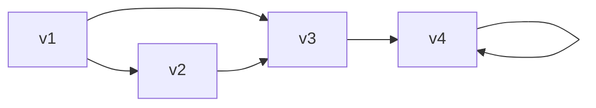
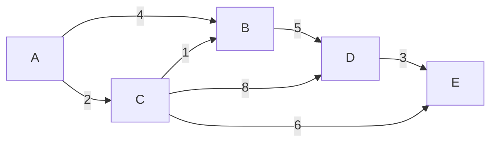

图Graph，本质上就两个东西：点**V**ertex，边**E**dges，写作G<V,E>，这两个字母之后常出现。

# 分类
+ 简单图：不含平行边，不含自环
+ 子图：和子集很像

# 度数
一个点相连的边数。
##### 握手定理
在G=<V,E>中，节点度数的总和等于边的数目的2倍。
$\sum_{v \in V}deg(v)=2 \cdot |E|$
+ 奇数的节点个数必为偶数。

# 有向图连通性
- **强连通**：任意顶点 u 和 v 之间，既有 u 到 v 的路径，也有 v 到 u 的路径。
- **单向连通**：任意两个顶点之间，至少存在一个方向的路径。
- **弱连通**：把有向边看成无向边后，图是连通的。

# 矩阵達
对于图

关联矩阵：每个顶点与每条边的**连接关系**：起点标 `+1`，终点标 `-1`，无关标 `0`（自环标 `0`）

$\begin{bmatrix}& e_1 & e_2 & e_3 & e_4 & e_5 \\v_1 & 1 & 1 & 0 & 0 & 0 \\v_2 & -1 & 0 & 1 & 0 & 0 \\v_3 & 0 & -1 & -1 & 1 & 0 \\v_4 & 0 & 0 & 0 & -1 & 0\end{bmatrix}$

邻接矩阵：每个顶点到每个其他顶点的**直达边数**：有边标 `1`（或权重），无边标 `0`

$A = \begin{bmatrix}0 & 1 & 1 & 0 \\0 & 0 & 1 & 0 \\0 & 0 & 0 & 1 \\0 & 0 & 0 & 1\end{bmatrix}$

可达矩阵：从邻接矩阵求**传递闭包**：若能经过任意步数到达（包括0步）标 `1`，否则 `0`

$R = \begin{bmatrix}1 & 1 & 1 & 1 \\0 & 1 & 1 & 1 \\0 & 0 & 1 & 1 \\0 & 0 & 0 & 1\end{bmatrix}$

# Dijkstra算法
### 方法简要
1. 初始化：起点 A 距离为 0，其他节点距离为 ∞，已访问集合为空。
2. 从未访问节点中选当前距离最小的节点 u。
3. 对 u 的每个邻接点 v，若 `dist[u] + w(u,v) < dist[v]`，则更新 `dist[v]`。
4. 标记 u 为已访问。
5. 重复步骤 2-4，直到所有节点被访问或目标节点被访问。

### 例
如下图：

| 当前节点 | A   | B   | C   | D   | E   | 已访问集合           |
|----------|-----|-----|-----|-----|-----|----------------------|
| 初始     | 0   | ∞   | ∞   | ∞   | ∞   | {}                   |
| 选 A     | 0   | 4   | 2   | ∞   | ∞   | {A}                  |
| 选 C     | 0   | 3   | 2   | 10  | 8   | {A, C}               |
| 选 B     | 0   | 3   | 2   | 8   | 8   | {A, C, B}            |
| 选 D     | 0   | 3   | 2   | 8   | 8   | {A, C, B, D}         |
| 选 E     | 0   | 3   | 2   | 8   | 8   | {A, C, B, D, E}      |

# 于历史人物们有关的图
### 欧拉图
+ 经过**每条边**恰好一次，并回到起点
+ **充要条件**：连通且每个顶点度数均为**偶数**
+ **半欧拉图**（欧拉路径存在但不闭合）：图连通且恰有 **2 个奇度顶点**（路径从一奇度顶点出发，到另一奇度顶点结束）。
### 哈密顿图
+ 经过**每个顶点**恰好一次，并回到起点
+ **无简单充要条件**（NP-完全问题）；仅有**充分条件**（如 Dirac 定理、Ore 定理）