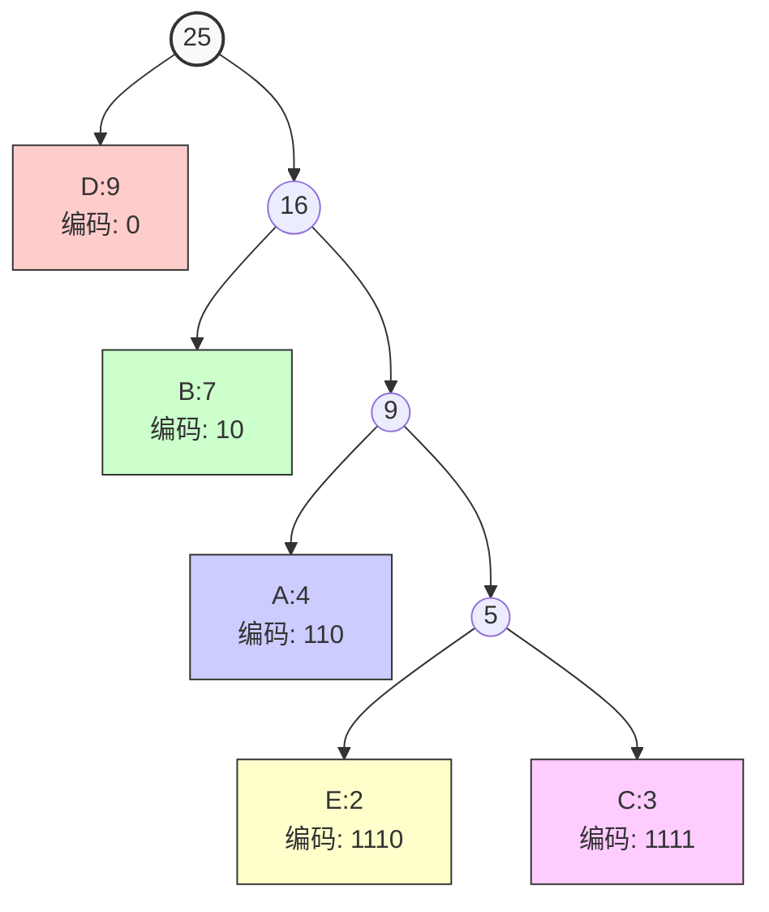

树 = 连通 + 无环 的[[图]]。

# 特点
- 连通（任意两节点有唯一路径）；
- 无环（没有简单回路）；
- 如果有 n 个节点，则边数恰好为 n-1。

# 名前持つ木達
### 有向树/根树
- **有一个根节点**：它的入度为 0（没有边指向它）。
- **其他每个节点**：入度恰好为 1（只有一条边从父节点指向它）。
- **从根到任意节点**：存在唯一的一条有向路径。

### 最小生成树
##### 1. Prim 算法（稠密图）
从一个点出发，每次选择连接**已选集合**和**未选集合**的**最短边**，将新点加入集合，直到所有点都加入。
**步骤**：
1. 任选一个起点（如节点 A），加入集合 U。
2. 找到 U 与 未选点之间权值最小的边，将对应的新点加入 U。
3. 重复第 2 步，直到所有点都在 U 中。
4. 所选边的集合就是 MST。
##### 2. Kruskal 算法（稀疏图）
将所有边按权值从小到大排序，依次选择**不形成环路**的边加入，直到选出 V-1 条边。
**步骤**：
1. 将图中所有边按权值升序排序。
2. 初始化并查集（每个点独自一个集合）。
3. 遍历排序后的边：
    - 如果该边连接的两个节点**不在同一个连通分量**（并查集 find 结果不同），则加入该边，并合并两个分量。
    - 否则跳过（会形成环）。
4. 当已选边数 = V-1 时停止。
##### 3. 破圈法（手工/理论推导）
在一个无向连通图中，如果存在一个环（circle），那么该环上权值最大的边一定**不属于任何最小生成树**。  
因为去掉这条最长边，环上其他边仍能连通所有顶点，且总权值更小。
**步骤**：
1. 找到图中任意一个环。
2. 去掉这个环上权值最大的一条边。
3. 重复直到图中没有环（此时就是生成树，且是最小的）。
最终剩余的 V-1 条边构成 MST。

### 最优二叉树：哈夫曼算法
#### 简述
- **初始化**：将每个字符及其频率作为叶子节点，放入最小堆（或按频率排序的列表）。
- **重复合并**：取出频率最小的两个节点，创建一个新的内部节点，其频率为两节点频率之和，左右子节点分别为这两个节点。
- **放回堆中**：将新节点放回集合中。
- **终止条件**：直到集合中只剩一个节点（即哈夫曼树的根）。
- **生成编码**：从根到叶子路径上，左分支标0，右分支标1，得到每个字符的哈夫曼编码。
#### 例题
给定字符及其出现频率：
A: 4  B: 7  C: 3  D: 9  E: 2
1. 初始频率排序：E(2), C(3), A(4), B(7), D(9)
2. 合并 E(2) 和 C(3) → 新节点1(5)   剩余：A(4), 节点1(5), B(7), D(9)
3. 合并 A(4) 和 节点1(5) → 新节点2(9)   剩余：B(7), 节点2(9), D(9)
4. 合并 B(7) 和 节点2(9) → 新节点3(16)   剩余：D(9), 节点3(16)
5. 合并 D(9) 和 节点3(16) → 根节点(25)
6. 编码（左0右1）D: 0   B: 10   A: 110   E: 1110   C: 1111

图：

