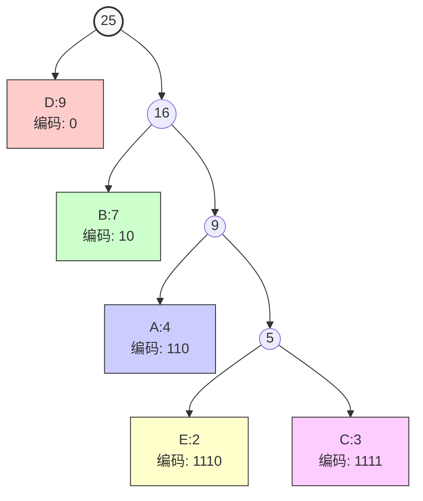

树 = 连通 + 无环 的[[图]]。

# 特点
- 连通（任意两节点有唯一路径）；
- 无环（没有简单回路）；
- 如果有 n 个节点，则边数恰好为 n-1。

# 最优树：哈夫曼算法
### 简述
- **初始化**：将每个字符及其频率作为叶子节点，放入最小堆（或按频率排序的列表）。
- **重复合并**：取出频率最小的两个节点，创建一个新的内部节点，其频率为两节点频率之和，左右子节点分别为这两个节点。
- **放回堆中**：将新节点放回集合中。
- **终止条件**：直到集合中只剩一个节点（即哈夫曼树的根）。
- **生成编码**：从根到叶子路径上，左分支标0，右分支标1，得到每个字符的哈夫曼编码。
### 例题
给定字符及其出现频率：
A: 4  B: 7  C: 3  D: 9  E: 2
1. 初始频率排序：E(2), C(3), A(4), B(7), D(9)
2. 合并 E(2) 和 C(3) → 新节点1(5)   剩余：A(4), 节点1(5), B(7), D(9)
3. 合并 A(4) 和 节点1(5) → 新节点2(9)   剩余：B(7), 节点2(9), D(9)
4. 合并 B(7) 和 节点2(9) → 新节点3(16)   剩余：D(9), 节点3(16)
5. 合并 D(9) 和 节点3(16) → 根节点(25)
6. 编码（左0右1）D: 0   B: 10   A: 110   E: 1110   C: 1111

图：

